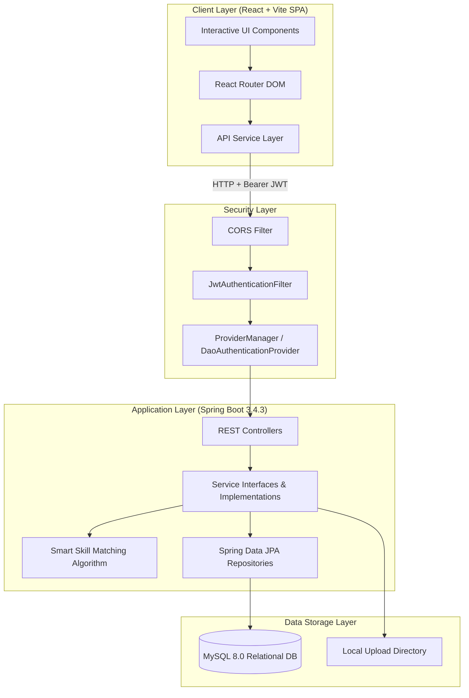
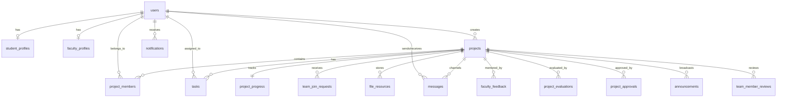

# 🎓 Student Project Collaboration Platform (CollabNexus)

[](https://spring.io/projects/spring-boot)
[](https://react.dev/)
[](https://vitejs.dev/)
[](https://www.mysql.com/)
[](https://openjdk.org/)
[](https://jwt.io/)
[](https://opensource.org/licenses/MIT)

> **A Full-Stack Academic Collaboration, Team Formation, Sprint Management, and Mentorship Platform for Engineering Colleges.**

---

## 📌 Overview

**CollabNexus (Student Project Collaboration Platform)** is a full-stack web application designed to facilitate academic project collaboration between students, team leaders, faculty mentors, and department administrators.

The platform provides a centralized environment for student portfolio discovery, smart skill-based team matching, agile Kanban sprint workspaces, structured multi-criteria faculty rubric evaluations, and academic governance.

---

## 👥 Project Modules & Team Contributions

The platform was engineered as a collaborative group project partitioned into four interconnected modules:

### 👤 Member 1 – Student Profile & Projects *(Salwa)*
- 👤 **Student Profile**: Comprehensive academic profile management with department, verified technical skills, bio, GitHub, and LinkedIn links.
- 💡 **Post Projects**: Publish new project proposals with title, description, required skills, and configurable team member limits (2–10 members).
- 🔎 **Search Projects**: Filter campus project directory by title keyword, required technical stack, and recruitment status.
- 🤝 **Request / Join Teams**: Submit applications with personalized pitch notes to join recruiting project teams.
- 🔔 **Notifications**: Actionable notification stream for join request status updates, task alerts, and system notices.
> **Total: 5 Features**

---

### 👨‍💻 Member 2 – Team Collaboration *(Shibla)*
- ⭐ **AI Smart Team Matching**: Rule-based skill compatibility scoring matching student candidate skills with project requirements.
- 📈 **Project Progress Tracking**: Automated weighted project completion percentage calculation (`0–100%`) rolled up from sprint tasks.
- ✅ **Task Creation & Assignment**: 3-stage agile Kanban sprint board (`TODO`, `IN_PROGRESS`, `COMPLETED`) with task assignment and due dates.
- 💬 **Team Chat & Direct Messaging**: Project workspace discussion rooms and 1-on-1 direct messaging.
- 📁 **File & Resource Sharing**: Multipart document/diagram uploads and external Git repository links.
> **Total: 5 Features**

---

### 👨‍🏫 Member 3 – Faculty Module *(Jasil)*
- 👤 **Faculty Profile**: Faculty profile with academic department, designation, and research specializations.
- 🔎 **Browse Student Projects**: Search and review all student project submissions across college departments.
- 📈 **Monitor Project Progress**: Real-time visibility into project sprint velocity, milestone progress, and member task contributions.
- 💬 **Give Feedback**: Provide qualitative mentorship review notes and 1–5 star ratings.
- ⭐ **Evaluate / Approve Projects**: Interactive 5-criterion rubric scoring (Scope, Technical, Execution, Presentation, Innovation -> Grade) and formal milestone sign-offs.
> **Total: 5 Features**

---

### 👨‍💼 Member 4 – Admin & System *(Rachel)*
- 👤 **Manage Students & Faculty**: User directory with institutional ID search (`STU...`/`FAC...`/`ADM...`) and account status toggles (`ACTIVE`, `SUSPENDED`).
- 📂 **Manage Projects**: Moderate all campus project records, inspect rosters, update project statuses, and maintain platform hygiene.
- 🔐 **Manage Roles & Permissions**: Dynamic permission matrix across `STUDENT`, `FACULTY`, and `ADMIN` roles.
- 📊 **Platform Analytics**: Real-time telemetry dashboard (active users, total projects, completed tasks, review rating averages).
- 📢 **Send Announcements**: System broadcaster with targeted audience scopes (`ALL`, `STUDENTS`, `FACULTY`, `PROJECT`).
- ⚠️ **Detect Delayed / Inactive Projects**: Automated health radar flagging overdue sprint tasks and dormant project workspaces.
- ⭐ **Rate & Review Team Members**: 360-degree peer reviews and teammate ratings for collaboration quality.
> **Total: 7 Features**

---

## 🚨 Problem Statement

In academic institutions, student project collaboration often faces practical challenges:

1. **Departmental Silos**: Students find it difficult to discover peers with complementary skills across different departments (e.g., Computer Science, Electronics, and Mechanical Engineering).
2. **Unstructured Team Formation**: Team recruitment is commonly handled via informal chat groups without clear visibility into project capacity, skill requirements, or applicant profiles.
3. **Task Tracking Gaps**: Milestone progress and task distribution are often undocumented, leading to unequal workload distribution and delayed submissions.
4. **Subjective Evaluation**: Faculty mentors lack continuous visibility into sprint velocity and must grade final projects without standardized, transparent rubrics.
5. **Lack of Administrative Telemetry**: Department coordinators lack a centralized view to monitor project health, detect inactive teams, and broadcast campus announcements.

---

## 💡 Solution

**CollabNexus** resolves these challenges by providing a structured academic workflow:

- **Smart Skill Matching**: A rule-based scoring algorithm that matches student profiles with open project requirements.
- **Capacity-Controlled Team Formation**: Team creation with strict seat limits (2–10 members), join request approvals, and leader role assignments.
- **Sprint Workspace & Kanban Board**: 3-stage task tracking (`TODO`, `IN_PROGRESS`, `COMPLETED`), automatic progress rollups, and file/repository sharing.
- **Standardized Faculty Evaluation**: A 5-criterion rubric scoring system (Scope, Technical, Execution, Presentation, Innovation) with automatic letter-grade computation.
- **Institutional Governance**: Role-based access control (RBAC), institutional ID management (`STU...`, `FAC...`, `ADM...`), and delayed sprint detection.

---

## 🛠️ Technology Stack

| Layer | Technology | Version | Purpose |
| :--- | :--- | :--- | :--- |
| **Frontend** | React | 18.x | Single-Page Application (SPA) framework |
| | Vite | 8.x | Frontend build tool and development server |
| | React Router DOM | 6.x | Client-side routing and protected routes |
| | Lucide React | Latest | Modern UI icon library |
| | CSS3 Design Tokens | — | Custom responsive styling system |
| **Backend** | Java | 17 LTS | Core backend programming language |
| | Spring Boot | 3.4.3 | REST API framework and dependency injection |
| | Spring Security | 6.x | Authentication, JWT filtering, and RBAC |
| | Spring Data JPA | 3.x | ORM and database abstraction layer |
| | Hibernate | 6.x | JPA entity lifecycle and relational mapping |
| | JJWT (io.jsonwebtoken)| 0.11.5 | JSON Web Token signing and parsing |
| | Lombok | 1.18.48 | Boilerplate code reduction |
| **Database** | MySQL | 8.0+ | Primary relational database |
| | H2 Database | 2.x | In-memory database for automated testing |
| **Build & Tooling**| Apache Maven | 3.8+ | Backend build and dependency management |
| | Node.js & npm | 18+ / 9+ | Frontend runtime and package management |

---

## 🏗️ Architecture



---

## 📁 Folder Structure

```
STUDENT PROJECT COLLABORATION PLATFORM
├── pom.xml                             # Root Maven POM (Project Orchestrator)
├── README.md                           # Master Project Documentation
├── walkthrough.md                      # Detailed Audit & Evaluation Log
├── LICENSE                             # MIT Open Source License
│
├── backend/                            # Spring Boot Application
│   ├── pom.xml                         # Backend Dependencies & Build Plugins
│   └── src/
│       ├── main/
│       │   ├── java/com/project/platform/
│       │   │   ├── PlatformApplication.java    # Spring Boot Main Class
│       │   │   ├── config/                     # SecurityConfig, AdminSeeder
│       │   │   ├── controller/                 # 18 REST API Controllers
│       │   │   ├── dto/                        # Request & Response Records
│       │   │   ├── entity/                     # 18 JPA Entities & Enums
│       │   │   ├── exception/                  # GlobalExceptionHandler & Error DTOs
│       │   │   ├── repository/                 # 18 Spring Data JPA Interfaces
│       │   │   ├── security/                   # JwtUtil, CustomUserDetailsService, UserPrincipal
│       │   │   └── service/                    # 18 Service Interfaces & Implementations
│       │   └── resources/
│       │       ├── application.yml             # MySQL Production Profile
│       │       └── application-local.yml       # H2 Test & Local Profile
│       └── test/                               # 18 Unit & Integration Test Classes
│
└── frontend/                           # React + Vite Application
    ├── package.json                    # Dependencies & Scripts
    ├── index.html                      # HTML5 Entry Point
    └── src/
        ├── App.jsx                     # Route Definitions & Protected Route Guards
        ├── main.jsx                    # React DOM Mounting
        ├── layouts/
        │   └── AppLayout.jsx           # Sidebar Navigation, Topbar & Mobile Drawer
        ├── pages/                      # 11 Application Views
        │   ├── LandingPage.jsx         # Public Workflow Overview
        │   ├── Login.jsx               # Tabbed Login & Registration Modals
        │   ├── Dashboard.jsx           # Overview Metrics & Quick Actions
        │   ├── Projects.jsx            # Project Directory & Pitch Dialog
        │   ├── Teams.jsx               # Team Roster, Join Queue & Skill Matcher
        │   ├── Tasks.jsx               # Kanban Sprint Board & Resource Sharing
        │   ├── Messages.jsx            # Channel & Direct Messaging
        │   ├── Notifications.jsx       # Alert Stream
        │   ├── Profile.jsx             # Student Portfolio & Skills Radar
        │   ├── Faculty.jsx             # Mentorship, Rubrics & Sign-Offs
        │   └── Admin.jsx               # User Directory & Health Radar
        ├── services/                   # API Integration Modules
        │   ├── adminService.js         # Auth, User Management & Analytics
        │   ├── collaborationService.js # Tasks, Skill Matching, Chat & Files
        │   ├── facultyService.js       # Evaluations, Rubrics & Feedback
        │   └── projectService.js       # Projects, Roster & Notifications
        └── styles/
            └── global.css              # Unified Design System Stylesheet
```

---

## 🗄️ Database Design

The relational database is normalized (3NF) and contains **18 core tables**:



### Key Tables & Schema Description

| Table Name | Primary Key | Foreign Keys / Constraints | Description |
| :--- | :--- | :--- | :--- |
| `users` | `id` | `email` (UQ), `institutional_id` (UQ) | User credentials, role (`STUDENT`, `FACULTY`, `ADMIN`), and status |
| `student_profiles` | `id` | `user_id` (UQ -> users.id) | Department, skills, bio, GitHub, and LinkedIn links |
| `faculty_profiles` | `id` | `user_id` (UQ -> users.id) | Designation, department, and academic specialization |
| `projects` | `id` | `created_by` (-> users.id) | Project title, description, skills, status, and max capacity (2–10) |
| `project_members` | `id` | `project_id`, `student_id` | Team membership join table with role (`LEADER`, `MEMBER`) |
| `tasks` | `id` | `project_id`, `assigned_to` | Sprint tasks with progress % and Kanban status |
| `project_progress` | `id` | `project_id` (UQ -> projects.id) | Computed project progress and last activity heartbeat |
| `team_join_requests`| `id` | `project_id`, `student_id` | Join applications with applicant notes and leader decision |
| `file_resources` | `id` | `project_id`, `uploaded_by` | Uploaded project files and external documentation links |
| `messages` | `id` | `project_id`, `sender_id`, `receiver_id` | Project room discussions and direct messages |
| `notifications` | `id` | `user_id` | User-targeted alert stream items |
| `faculty_feedback` | `id` | `project_id`, `faculty_id` | Mentorship review notes and 1–5 ratings |
| `project_evaluations`| `id` | `project_id`, `faculty_id` | 5-criterion rubric scores (0–100) and computed letter grade |
| `project_approvals` | `id` | `project_id`, `faculty_id` | Stage-gate status approvals (`APPROVED`, `REJECTED`, `CHANGES_REQUESTED`) |
| `announcements` | `id` | `created_by`, `project_id` | System and campus broadcast notices |
| `team_member_reviews`| `id`| `project_id`, `reviewer_id`, `reviewee_id` | Peer collaboration feedback and star ratings |
| `platform_analytics`| `id` | — | Historical platform metrics snapshots |
| `role_permissions` | `id` | — | Configurable permission mappings per role |

---

## 🌐 API Overview

### 🔑 Authentication (`/api/auth`)
| HTTP Method | Endpoint | Description | Access |
| :--- | :--- | :--- | :--- |
| `POST` | `/api/auth/login` | General login (Institutional ID / Email) | Public |
| `POST` | `/api/auth/student/login` | Student login portal | Public |
| `POST` | `/api/auth/faculty/login` | Faculty login portal | Public |
| `POST` | `/api/auth/admin/login` | Admin login portal | Public |
| `POST` | `/api/auth/register/student` | Register new student profile | Public |
| `POST` | `/api/auth/register/faculty` | Register new faculty profile | Public |

### 🚀 Projects & Teams (`/api/projects`, `/api/teams`)
| HTTP Method | Endpoint | Description | Access |
| :--- | :--- | :--- | :--- |
| `GET` | `/api/projects` | Filter and paginate campus projects | Public / Student |
| `POST` | `/api/projects` | Pitch a new project with capacity | Student / Faculty |
| `GET` | `/api/projects/{id}` | Get project details and team roster | Public / Authenticated |
| `POST` | `/api/projects/{id}/join-requests` | Submit application to join a project | Student |
| `PATCH` | `/api/projects/{id}/join-requests/{reqId}` | Accept or reject a join request | Project Leader |
| `GET` | `/api/teams/match-candidates/{projId}` | Get smart candidate recommendations | Authenticated |
| `GET` | `/api/teams/match-projects` | Get smart project recommendations | Authenticated |

### 📋 Sprint Workspace (`/api/tasks`, `/api/files`, `/api/messages`)
| HTTP Method | Endpoint | Description | Access |
| :--- | :--- | :--- | :--- |
| `GET` | `/api/tasks/project/{projectId}` | Get sprint tasks for a project | Authenticated |
| `POST` | `/api/tasks` | Create a new sprint task | Authenticated |
| `PATCH` | `/api/tasks/{id}/status` | Update task status (`TODO`/`IN_PROGRESS`/`COMPLETED`) | Authenticated |
| `POST` | `/api/files/upload` | Upload document or diagram | Authenticated |
| `POST` | `/api/files/resource` | Add Git repository or link | Authenticated |
| `POST` | `/api/messages` | Send project channel or direct message | Authenticated |

### 🎓 Faculty Mentorship (`/api/faculty`)
| HTTP Method | Endpoint | Description | Access |
| :--- | :--- | :--- | :--- |
| `GET` | `/api/faculty/projects/{id}/progress` | Monitor project velocity and progress | Faculty / Admin |
| `POST` | `/api/faculty/projects/{id}/feedback` | Submit mentorship review and rating | Faculty / Admin |
| `POST` | `/api/faculty/projects/{id}/evaluations`| Submit 5-dimension rubric score | Faculty / Admin |
| `POST` | `/api/faculty/projects/{id}/approval` | Submit project milestone approval | Faculty / Admin |

### 🛡️ Admin & Analytics (`/api/admin`, `/api/analytics`, `/api/announcements`)
| HTTP Method | Endpoint | Description | Access |
| :--- | :--- | :--- | :--- |
| `GET` | `/api/admin/users` | List and paginate all users | Admin |
| `PATCH` | `/api/admin/users/{id}/status` | Update user status (`ACTIVE`/`SUSPENDED`)| Admin |
| `GET` | `/api/admin/projects/health/flagged` | View delayed or inactive projects | Admin |
| `GET` | `/api/analytics/live` | View live platform metrics | Admin |
| `POST` | `/api/announcements` | Broadcast campus announcement | Admin |

---

## ⚙️ Installation Steps

### Prerequisites
- **Java JDK**: Version 17+
- **Node.js**: Version 18+ and npm
- **Apache Maven**: Version 3.8+
- **MySQL Server**: Version 8.0+

---

### 1. Database Setup

1. Start your local MySQL service.
2. Create the database schema:
   ```sql
   CREATE DATABASE student_platform CHARACTER SET utf8mb4 COLLATE utf8mb4_unicode_ci;
   ```

---

### 2. Backend Setup (Spring Boot)

1. Navigate to the backend folder:
   ```bash
   cd backend
   ```
2. Configure your database credentials in `src/main/resources/application.yml` or set environment variables:
   ```yaml
   spring:
     datasource:
       url: jdbc:mysql://localhost:3306/student_platform?useSSL=false&allowPublicKeyRetrieval=true&serverTimezone=UTC
       username: your_mysql_username
       password: your_mysql_password
   ```
3. Compile and launch the Spring Boot application:
   ```bash
   mvn clean spring-boot:run
   ```
4. The backend server will start at `http://localhost:8080`. Sample seed data will automatically be populated on initial startup.

---

### 3. Frontend Setup (React + Vite)

1. Open a new terminal and navigate to the frontend folder:
   ```bash
   cd frontend
   ```
2. Install npm dependencies:
   ```bash
   npm install
   ```
3. Start the Vite development server:
   ```bash
   npm run dev
   ```
4. Open your browser and navigate to `http://localhost:5173`.

---

## 🔑 Environment Variables

### Backend Configuration (`application.yml` / Shell Environment)

| Variable | Description | Example / Placeholder |
| :--- | :--- | :--- |
| `DB_HOST` | MySQL Server Hostname | `localhost` |
| `DB_PORT` | MySQL Server Port | `3306` |
| `DB_NAME` | Database Name | `student_platform` |
| `DB_USERNAME` | Database Username | `your_db_username` |
| `DB_PASSWORD` | Database Password | `your_db_password` |
| `JWT_SECRET` | Secret Key for Signing JWT Tokens (256-bit min) | `your_secure_jwt_secret_key_here` |
| `JWT_EXPIRATION_MS`| JWT Expiration Duration in Milliseconds | `86400000` (24 Hours) |
| `SPRING_PROFILES_ACTIVE`| Active Profile (`local` for H2, `prod` for MySQL) | `local` |

### Frontend Configuration (`.env`)

| Variable | Description | Example / Placeholder |
| :--- | :--- | :--- |
| `VITE_API_BASE_URL` | Backend REST API Base URL | `http://localhost:8080` |

---

## 🧪 Demonstration & Seed Accounts

The platform comes pre-configured with sample accounts for demonstration and evaluation purposes:

| Role | Institutional ID | Email | Password Note |
| :--- | :--- | :--- | :--- |
| **Student (Project Leader)** | `STU10001` | `ananya@college.edu` | Configured during initial seeding *(change before deployment)* |
| **Student (Contributor)** | `STU10006` | `devika@college.edu` | Configured during initial seeding *(change before deployment)* |
| **Faculty Mentor** | `FAC10001` | `meera@college.edu` | Configured during initial seeding *(change before deployment)* |
| **Platform Administrator** | `ADM10001` | `admin@college.edu` | Configured during initial seeding *(change before deployment)* |

---

## 📸 Screenshots

*(Add your application screenshots here)*

- **Landing Page**: Public portal showcasing project collaboration workflows.
- **Login & Registration**: Role-segregated login and student/faculty onboarding dialogs.
- **Student Dashboard**: Live summary of joined teams, pending requests, and smart recommendations.
- **Project Directory**: Campus project listings with search, skill tags, and seat counters.
- **Sprint Workspace & Kanban Board**: 3-column sprint task management with velocity progress bars.
- **Faculty Dashboard & Rubrics**: Project monitoring radar and 5-criteria grading form.
- **Admin Management Console**: User moderation table, broadcast system, and delayed sprint alerts.

---

## 🚀 Deployment

The project can be deployed across modern cloud hosting providers:

| Layer | Recommended Provider | Build / Start Command | Output Directory |
| :--- | :--- | :--- | :--- |
| **Frontend** | [Vercel](https://vercel.com/) / [Netlify](https://www.netlify.com/) | `npm run build` | `dist` |
| **Backend** | [Render](https://render.com/) / [AWS EC2](https://aws.amazon.com/) / [Docker](https://www.docker.com/) | `mvn clean package -DskipTests` | `target/platform-0.0.1-SNAPSHOT.jar` |
| **Database** | [MySQL](https://www.mysql.com/) / [AWS RDS](https://aws.amazon.com/rds/) / [Aiven](https://aiven.io/) | — | Port `3306` |

---

## 🔮 Future Enhancements

- 🔴 **Real-Time WebSockets**: Upgrade direct chat and Kanban card transitions to live STOMP/WebSocket streams.
- ☁️ **Cloud Storage Integration**: Connect Amazon S3 or Google Cloud Storage for scalable document uploads.
- 📅 **Calendar & Viva Scheduling**: Integration with Google Calendar for faculty viva and milestone review meetings.
- 📱 **Mobile Responsive App**: Native mobile app using React Native for push notifications and on-the-go discussions.

---

## 👥 Contributors & Team Members

| Name | Module Assignment | Key Responsibilities | Features Owned |
| :--- | :--- | :--- | :---: |
| **Salwa** | **Member 1 – Student Profile & Projects** | Student Profiles, Project Pitching, Campus Project Search, Join Requests & Notifications | **5 Features** |
| **Shibla** | **Member 2 – Team Collaboration** | Smart Skill Matching, Sprint Progress Tracking, Kanban Tasks, Chat & File Sharing | **5 Features** |
| **Jasil** | **Member 3 – Faculty Module** | Faculty Profiles, Project Browsing, Velocity Monitoring, Mentorship Feedback & Rubric Evaluations | **5 Features** |
| **Rachel** | **Member 4 – Admin & System** | Student/Faculty Management, Project Moderation, RBAC Permissions, Analytics, Announcements, Health Radar & Peer Reviews | **7 Features** |

**Project Guide / Faculty Mentor:**
- **Department of Computer Science & Engineering**

---

## 📄 License

This project is licensed under the **MIT License** — see the [LICENSE](LICENSE) file for details.
